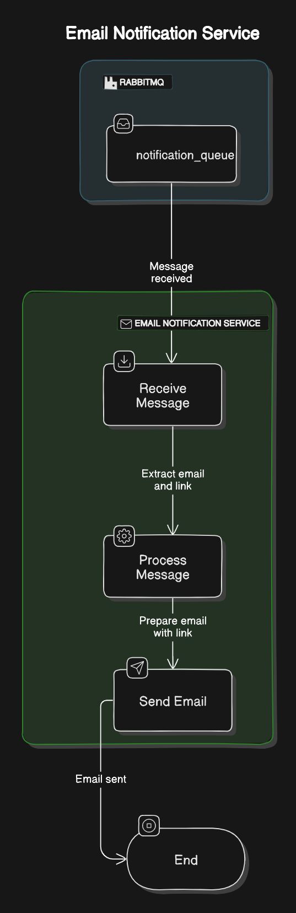

# Projeto Notification RabbitMQ

Este projeto é um consumidor RabbitMQ que mandas notificacoes via emails com link de download temporário.

## Arquitetura das APIs


## Funcionalidades

- **Consome vídeos de uma fila RabbitMQ**
- **Envia uma mensagem para via email para o email do usuario especificado na menssagem da queue**
- **Implementa uma arquitetura limpa que isola componentes em camdas logicas**

## Estrutura do Projeto
```bash
C:.
├───.github
│   └───workflows
├───notification
│   ├───core
│   ├───schemas
│   ├───services
└───tests
```

## Docker Container
A aplicação é dockerizada de maneira eficiente utilizando o Docker. O Dockerfile inclui comandos otimizados e cache para garantir uma construção rápida e leve da imagem. Após a construção, a imagem é enviada para o Docker Hub, facilitando o deployment em ambientes de produção e desenvolvimento.
para buildar a imagem localmente
```bash
docker build -t notification_service .
```

## GITOPS e K8S
Este repositório implementa o GitOps em conjunto com o Argo CD. Ele lê a pasta `k8s` na branch `gitops` e automaticamente aplica os manifests no meu cluster Kubernetes. Além disso, a imagem do deployment é automaticamente modificada toda vez que há um commit na branch `master`, refletindo o aumento de versão do projeto.

Para acessar a branch
```bash
git checkout gitops
```
